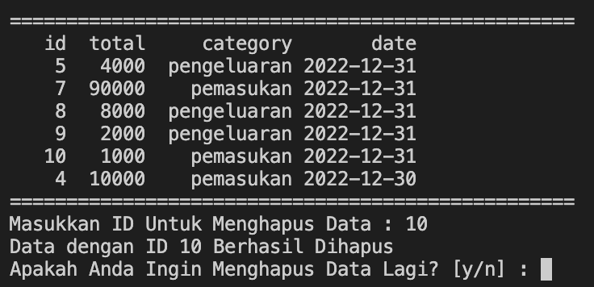

# TUGAS PRAKTIK UAS

---

NAMA : ALI MUSTOFA

NIM : A182200016

---

## OVERVIEW

Aplikasi ini adalah aplikasi pencatatan keunagan personal yang dapat membantu user untuk mengelola dan mencatan keuangan pribadi. Aplikasi ini dibuat penggunakan bahasa pemrograman Python, untuk menyimpanan database menggunakan MongoDB, dan *Interface* berbasis terminal.

## Structure Data

MongoDB adalah salah satu jenis database [NoSQL](https://www.niagahoster.co.id/blog/nosql-adalah/) yang cukup populer digunakan dalam pengembangan website. Berbeda dengan database jenis [SQL](https://www.niagahoster.co.id/blog/apa-itu-query-sql/) yang menyimpan data menggunakan relasi tabel, MongoDB menggunakan dokumen dengan format [JSON](https://www.niagahoster.co.id/blog/json-adalah/). Berikut data JSON yang digunakan untuk menyimpan transaksi.

```json
{
  "_id": {
    "$oid": "63ab3d2a4edacab8c1f8ed97"
  },
  "data_cat": "uas",
  "id": 5,
  "total": 4000,
  "category": 0,
  "date": {
    "$date": "2022-12-31T00:00:00Z"
  }
}
```

Dari data JSON diatas terdapat beberapa kunci/key berikut adalah keynya:

* _id : Type data *unique* dan *autoincrement* yang terlah disediakan MongoDB.
* data_cat : Type data string yang digunakan sebagai parameter, berhubung aplikasi ini digunakan untuk uas, maka nilainya ada "uas".
* id: Type data interger yang digunakan sebagai id dan bersifat unique, diambil dari nilai id terkahir dan +=1. Dimasukkan secara auto oleh aplikasi sebagai entitas dari suatu data.
* total: Type data interger yang berisi jumlah uang pemasukan/pengeluaran yang dimasukan oleh user
* category: Type data integer yang berisi dari id category, untuk mendapatkan id tersebut aplikasi mempunyai list berisi pemasukan dan pengeluaran, dari inputan user maka kategory tersebut diambil berdasarkan index.
* date: Type data date berisi tanggal pengeluaran/pemasukan suatu transaksi.

## USER INTERFACE

Untuk memudahkan user dalam memasukkan data, maka aplikasi tersebut menggunakan interface yang menerima input. Aplikasi ini menggunakan interface berbasis terminal. Halaman utama aplikasi akan menampilkan Menu.


Gambar diatas adalah menu dari aplikasi, terdapat 6 id menu yang bisa digunakan oleh user.

* ID 1 : User akan diarahkan ke penambahan data pemasukan/pengeluaran yang berisi memasukan kategori, jumlah dan tanggal transaksi.

  
* ID 2 : User akan diarahkan ke halaman edit data serta aplikasi akan menampilkan data transaksi, untuk mengedit data user akan memasukan id dari data transaksi yang akan diedit dan memasukkan data sesuai dengan yang akan diedit.

  
* ID 3 : User akan diarahkan ke halaman hapus data, seperti ID 2, aplikasi akan menampilkan data transaksi dan kemudian user akan memilih id sebagai entitas data yang akan dihapus.

  
* ID 4 : User akan diarahakan untuk melihat data transaksi baik pengeluaran atau pemasukan yang diurutkan berdasarkan tanggal terakhir.

  
* ID 5 : User akan diarahkan untuk melihat total transaksi pengeluaran, pemasukan, dan saldo.

  
* ID 0 : Jika user ingin melakukan keluar dari aplikasi.